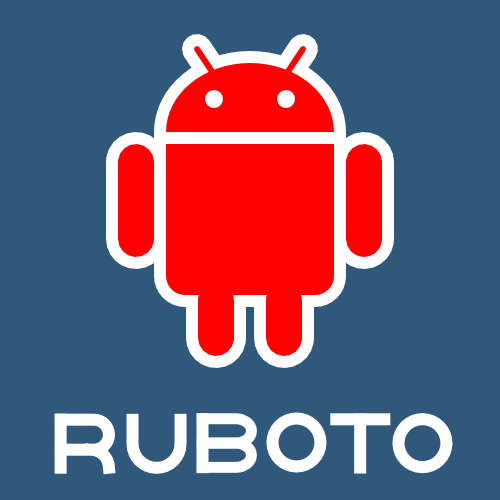

<!--

-->

# Ruboto -- Ruby on Android

Ruboto allows you to run Ruby scripts on Android devices.  Using Ruby code, you have access to the complete Android API.  Currently, we have 2 offerings:  ruboto and ruboto-irb.  Ruboto is based on [JRuby](http://jruby.org).

 

## ruboto gem

[ruboto on GitHub](http://github.com/ruboto/ruboto/)

Ruboto is a framework for writing full Android apps in Ruby.  It includes support libraries and generators for creating projects, classes, tests, and more.

## ruboto-irb

[ruboto-irb on GitHub](http://github.com/ruboto/ruboto-irb/)

ruboto-irb is an Android application installable from the Android Market and includes an IRB (Interactive Ruby) console and also allows you to run predefined or uploaded scripts.  All scripts can interface with the full Android API.  You can also create shortcuts to scripts directly from the home screen.

You can install ruboto-irb from the Android Market or download it directly to your Android device here:

[ruboto-irb download](http://www.androidzoom.com/android_applications/tools/ruboto-irb-ruby-on-android_hwcd_download.html)

## Community

* [Wiki](https://github.com/ruboto/ruboto/wiki)
* [Mailing list](http://groups.google.com/group/ruboto)
* IRC chat: [#ruboto](irc://irc.freenode.net/ruboto) on Freenode.
* [Issue tracker](https://github.com/ruboto/ruboto/issues)
* [Continuos Integration](http://ci.jruby.org/view/Ruboto/)
* [Merchandise](http://www.cafepress.co.uk/ruboto)
